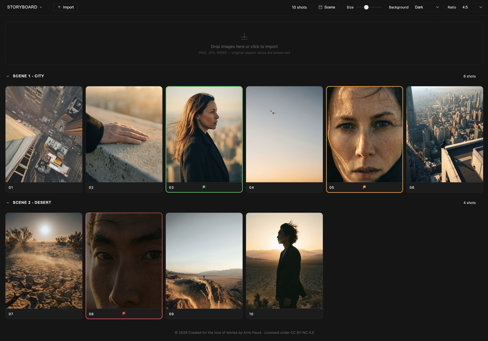

# Storyboard

A 100% free, single-file storyboard web app — created for the love of stories by [Arno Faure](https://arnofaure.com).

🔗 **[storyboard.arnofaure.com](https://storyboard.arnofaure.com)**

## Features

- Drag & drop images to build your storyboard
- Organize shots into scenes with collapsible sections
- Reorder shots and scenes via drag and drop
- Flag shots (green / orange / red) to track status
- Multiple background themes (dark, white, grey, dark grey)
- Toggle file names and duplicate-image highlighting
- Undo (Cmd/Ctrl+Z)
- Export to images, PDF, or FCPXML (DaVinci Resolve / Final Cut Pro / ...)
- Save/open projects as JSON
- Runs entirely in your browser — no account, no upload, no tracking

### Timeline & Player

- **NLE-style timeline** at the bottom — toggle it from the toolbar; shows all shots in sequence, grouped by scene
- **Keyboard navigation** — ← → to step through shots when the timeline is open
- **Floating player** — open it via the monitor icon on the timeline sidebar; drag to reposition, resize freely, reset size/position with the ⊿ button
- **Playback** — play/pause (Space), prev/next, adjustable speed (0.5s to 5s per shot)
- **Aspect ratios** — choose from 1.85:1, 16:9, 2.39:1, 1.43:1, 1:1, 4:5, 3:5, or 9:16; the player window auto-adapts its shape to the selected ratio

## Usage

Just open `index.html` in a browser, or visit [storyboard.arnofaure.com](https://storyboard.arnofaure.com).

## How to use it

1. **Everything stays on your device.** Storyboard runs entirely in your browser — your images and project are never uploaded, no account needed.
2. **Nothing is saved automatically.** Use **Save** (in the menu) to download a project file (`.json`) — keep it to continue your work later.
3. **Resume a project** with **Open** and select that `.json` file — your shots, flags, scenes and settings come right back.
4. **Timeline.** Toggle the shot timeline at the bottom with the Timeline button. Use ← → to navigate between shots.
5. **Player.** Click the monitor icon on the left of the timeline to open the floating player. Play through your shots, adjust speed, drag to reposition, resize, or reset with the ⊿ icon.

The same info is available anytime in the app via **Menu → Help**.

## Contact

Bug, idea, or feature request? — [info@arnofaure.com](mailto:info@arnofaure.com)

## License

Code is open source. Content/branding is licensed under [CC BY-NC 4.0](https://creativecommons.org/licenses/by-nc/4.0/).
